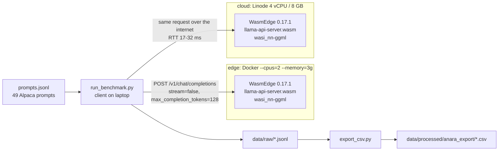

# wasm-slm-edge-cloud-bench

**How fast do small, quantized LLMs actually run inside WebAssembly, at the edge versus in the cloud?**

[](LICENSE)
[](LICENSE-DATA)
[](LICENSE-DATA)


[](https://doi.org/10.5281/zenodo.23187225)

This repository is the artifact for an empirical study of **WasmEdge / WASI-NN** small-LLM inference
across a resource-capped **edge** profile and a dedicated-CPU **cloud** VM. It contains every
per-request measurement (including the runs that were thrown away, and why), the benchmark harness that
produced them, the exact prompt set, and the environment needed to reproduce them.

---

## At a glance

| | |
|---|---|
| **Models** | TinyLlama-1.1B-Chat-v1.0, Qwen2.5-0.5B-Instruct (GGUF) |
| **Quantization** | Q4_K_M, Q8_0, F16 |
| **Hosts** | `edge`: Docker-capped 2 vCPU / 3 GB (Ryzen 5 5500U, WSL2) · `cloud`: Linode dedicated 4 vCPU / 8 GB (EPYC 7713) |
| **Runtime** | WasmEdge 0.17.1 + `wasi_nn-ggml` 0.1.34.0, LlamaEdge `llama-api-server` 0.29.0, CPU only |
| **Prompts** | 49 Stanford Alpaca instructions, stratified short (20) / medium (20) / long (9) |
| **Protocol** | 3 repetitions per prompt, first discarded as warmup, 128-token generation cap, non-streaming |
| **Size** | 12 configurations x 147 requests = **1,764 requests**, of which **1,176** are analyzed (98 per configuration) |
| **Also included** | 367 discarded rows documenting four LlamaEdge generation-cap defects |

## Key findings

**1. Lower bits are not faster here.** In all four (host, model) groups, **Q8_0 is the fastest
quantization level**, roughly 3.6-3.9x faster than Q4_K_M and 3.7-5.5x faster than F16 in mean latency.

**2. Prompt length dominates.** Latency rises monotonically from short to long prompts in all 12
configurations, about 2-4x, on top of the fixed 128-token cap.

**3. The serving runtime silently ignores generation-length limits.** Four distinct defects in
LlamaEdge 0.29.0 let generation run past the configured cap (see [Runtime defects](#runtime-defects-llamaedge-0290)).
Any latency benchmark on this runtime that does not work around them is measuring output length, not speed.

### Summary by configuration

Computed from `data/processed/anara_export/measurements.csv` (warmup rows excluded, n = 98 each).
Throughput is the mean of per-request `output_tokens / total_latency`.

| Host | Model | Quant | Median latency (s) | Mean latency (s) | Mean output tokens | Mean peak RSS (MB) | Throughput (tok/s) |
|---|---|---|---:|---:|---:|---:|---:|
| edge | TinyLlama-1.1B | Q4_K_M | 65.2 | 77.0 | 104.9 | 901 | 1.47 |
| edge | TinyLlama-1.1B | **Q8_0** | **18.0** | **21.1** | 101.7 | 1,376 | **5.18** |
| edge | TinyLlama-1.1B | F16 | 93.5 | 115.3 | 104.8 | 2,362 | 0.99 |
| edge | Qwen2.5-0.5B | Q4_K_M | 18.8 | 23.0 | 55.7 | 766 | 2.58 |
| edge | Qwen2.5-0.5B | **Q8_0** | **4.6** | **5.9** | 51.1 | 920 | **9.28** |
| edge | Qwen2.5-0.5B | F16 | 24.3 | 32.5 | 52.5 | 1,481 | 1.69 |
| cloud | TinyLlama-1.1B | Q4_K_M | 77.4 | 93.4 | 104.6 | n/a | 1.20 |
| cloud | TinyLlama-1.1B | **Q8_0** | **22.9** | **26.3** | 102.5 | n/a | **4.21** |
| cloud | TinyLlama-1.1B | F16 | 82.4 | 98.5 | 103.6 | n/a | 1.12 |
| cloud | Qwen2.5-0.5B | Q4_K_M | 23.7 | 28.7 | 56.2 | n/a | 2.04 |
| cloud | Qwen2.5-0.5B | **Q8_0** | **5.7** | **7.6** | 51.1 | n/a | **7.20** |
| cloud | Qwen2.5-0.5B | F16 | 23.4 | 30.0 | 51.6 | n/a | 1.78 |

Peak RSS is `n/a` (not zero) on the cloud host: remote sampling over SSH never returned values.
Latency variance is high (SD is often 40-65% of the mean), so treat edge-vs-cloud differences as descriptive.

---

## Quick start: load the data

```python
import pandas as pd

df = pd.read_csv("data/processed/anara_export/measurements.csv")
df = df[~df["is_warmup"]]                      # drop warmup repetitions

summary = (df.groupby(["host", "model", "quant"])["total_latency_ms"]
             .agg(["count", "median", "mean"]))
print(summary.round(0))
```

Or straight from the raw files:

```python
import glob
import pandas as pd

raw = pd.concat(pd.read_json(f, lines=True)
                for f in glob.glob("data/raw/*.jsonl")
                if "discarded" not in f and "pilot" not in f)
```

## Measurement setup



Both servers run with identical flags:
`--prompt-template zephyr --ctx-size 640 --n-gpu-layers 0 --n-predict 128 --temp 0.1`.
`--ctx-size 640` is a deliberate workaround for defect D2, not a default.

---

## Repository layout

```
data/
  raw/                     one JSONL row per request, file = <host>_<model>_<quant>.jsonl
    *.discarded_*.jsonl    excluded runs, kept for transparency (reason in file name)
    pilot_*.jsonl          uncapped smoke test, NOT edge-profile data
  prompts/
    prompts.jsonl          the 49 benchmark prompts
    pilot_prompts.jsonl    5 prompts used for the pilot only
  processed/
    host_specs.md          hardware, OS, runtime versions, server flags
    anara_export/
      measurements.csv     all kept rows (1,764 incl. warmup)
      discarded_runs.csv   all discarded rows + discard_reason
      request_accounting.csv  issued / warmup / analyzed per configuration
      prompts.csv          prompts in CSV form
harness/
  sample_prompts.py        builds the stratified prompt set from Alpaca (fixed seed)
  run_benchmark.py         runs the sweep against a running llama-api-server
  export_csv.py            raw JSONL -> processed CSVs
  config.yaml              hosts, models, repetitions, timeout, n_predict
setup/
  SETUP.md                 step-by-step environment setup (WSL2, WasmEdge, LlamaEdge, cloud VM)
  Dockerfile.edge          the resource-capped edge image
docs/
  experiment_design.md     full methodology and design rationale
```

## Data dictionary

Applies to `data/raw/*.jsonl` and `measurements.csv`. `discarded_runs.csv` adds `source_file` and `discard_reason`.

| Field | Type | Meaning |
|---|---|---|
| `host` | str | `edge`, `cloud`, or `pilot` |
| `model` | str | `tinyllama-1.1b` or `qwen2.5-0.5b` |
| `quant` | str | `Q4_K_M`, `Q8_0`, or `F16` |
| `prompt_id` | str | e.g. `short-000`; joins to `id` in `prompts.jsonl` |
| `bucket` | str | `short` (<64 tok), `medium` (64-256), `long` (256-512); approx. word count x 1.3 |
| `repetition` | int | 0, 1, 2 |
| `is_warmup` | bool | `true` for repetition 0; exclude from analysis |
| `total_latency_ms` | float | client-measured wall time for the whole request (prompt processing + generation) |
| `approx_output_tokens` | int | `usage.completion_tokens` as reported by the server |
| `peak_rss_mb` | float / null | peak resident memory of the WasmEdge process; edge only |
| `ttft_ms` | null | time to first token; unavailable because streaming is unusable (D3) |
| `tokens_per_sec` | null | decode-only throughput; unavailable for the same reason |

### Discarded runs

| File | Rows | Why it was discarded |
|---|---:|---|
| `edge_tinyllama-1.1b_Q4_K_M.discarded_unenforced_npredict.jsonl` | 145 | collected before the D1 fix; generation was not actually capped |
| `cloud_tinyllama-1.1b_Q4_K_M.discarded_unenforced_npredict.jsonl` | 200 | same, cloud host (collected at 5 repetitions) |
| `edge_tinyllama-1.1b_Q4_K_M.discarded_streaming_uncapped.jsonl` | 4 | streaming attempt; cap ignored (D3) |
| `edge_tinyllama-1.1b_Q4_K_M.discarded_n_predict256.jsonl` | 8 | partial rows under an earlier 256-token cap, superseded by 128 |
| `pilot_tinyllama-1.1b_Q4_K_M.jsonl` | 10 | uncapped pipeline smoke test |

---

## Runtime defects (LlamaEdge 0.29.0)

Found during data collection, root-caused by reading the release source, and reproduced on both hosts.

| ID | Defect | Effect | Workaround used |
|---|---|---|---|
| **D1** | If a request omits `max_completion_tokens`, the server's `--n-predict` is ignored | Generation is effectively unbounded (one request ran 18.6 min, >2,500 tokens). Log: `Update n_predict with max_completion_tokens from 128 to 2147483647` | Send `max_completion_tokens` on every request |
| **D2** | `update_n_predict` overrides the requested cap with `ctx_size - ctx_size*4/5` whenever the request's cap is smaller | At `--ctx-size 2048` a 128-token cap silently became 410 | Use `--ctx-size 640`, where the derived value equals 128 |
| **D3** | Streaming (`stream: true`) never counts emitted tokens against the cap | 186 SSE chunks vs 128 tokens for the identical request | Non-streaming only, so no TTFT |
| **D4** | Aborting a stream client-side does not stop the server | Server keeps generating for minutes with its request lock held, blocking queued requests | None client-side; switch to non-streaming |

## Reproducing the sweep

1. **Environment.** Follow [`setup/SETUP.md`](setup/SETUP.md): WasmEdge 0.17.1, `wasi_nn-ggml` 0.1.34.0,
   LlamaEdge `llama-api-server.wasm` 0.29.0. Build the edge image from `setup/Dockerfile.edge`
   and run it with `--cpus=2 --memory=3g`.
2. **Models** (not included, multi-GB):
   - [`TheBloke/TinyLlama-1.1B-Chat-v1.0-GGUF`](https://huggingface.co/TheBloke/TinyLlama-1.1B-Chat-v1.0-GGUF): Q4_K_M, Q8_0
   - [`andrijdavid/TinyLlama-1.1B-Chat-v1.0-GGUF`](https://huggingface.co/andrijdavid/TinyLlama-1.1B-Chat-v1.0-GGUF): F16
   - [`Qwen/Qwen2.5-0.5B-Instruct-GGUF`](https://huggingface.co/Qwen/Qwen2.5-0.5B-Instruct-GGUF): Q4_K_M, Q8_0, F16
3. **Configure.** Replace `<CLOUD_HOST>` and `<SSH_USER>` in `harness/config.yaml`.
4. **Run.**
   ```bash
   pip install -r harness/requirements.txt
   cd harness
   python sample_prompts.py      # optional: regenerates data/prompts/prompts.jsonl (fixed seed)
   python run_benchmark.py       # see its docstring: one server per (model, quant), restarted by hand
   python export_csv.py          # rebuilds data/processed/anara_export/
   ```

## Limitations

- The edge profile is an emulated constraint (Docker cap on a laptop), not a physical edge device.
- Peak memory is edge-only; TTFT and decode-only throughput are unavailable (D3).
- 98 measured requests per configuration and no significance testing: host differences are descriptive.
- Results are specific to this WasmEdge / plugin / LlamaEdge build; the Q8_0 > Q4_K_M ordering may not hold elsewhere.

## License

- **Code** (`harness/`, `setup/`): [MIT](LICENSE)
- **Measurements and docs**: [CC BY 4.0](LICENSE-DATA)
- **Prompt text** (`data/prompts/`, `prompts.csv`): derived from [Stanford Alpaca](https://github.com/tatsu-lab/stanford_alpaca), **CC BY-NC 4.0**, non-commercial use only

## Citation

If you use this dataset or harness, please cite it (see also [`CITATION.cff`](CITATION.cff)):

```bibtex
@dataset{kharel_wasm_slm_bench_2026,
  author    = {Kharel, Atul Ballav},
  title     = {wasm-slm-edge-cloud-bench: Quantized small-LLM inference across the WebAssembly edge-cloud boundary},
  year      = {2026},
  publisher = {Zenodo},
  version   = {1.0.0},
  doi       = {10.5281/zenodo.23187225},
  url       = {https://doi.org/10.5281/zenodo.23187225}
}
```

References to `docs/PROGRESS_LOG.md` in code comments point to the author's private lab notebook, which is not included.
